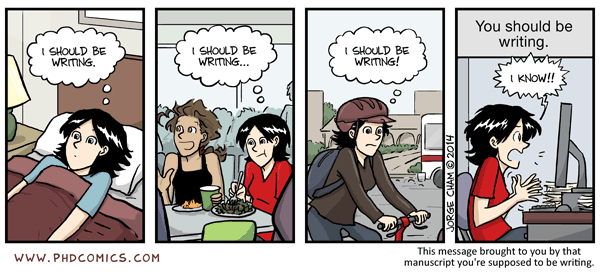

My Foolish Latex Template
---

## Info

- target: xxxx-yy
- deadline: 20yy-mm-dd

## Workflow

- [ ] apply style files specified by the target conference/journal
- [ ] create an overleaf project and import this repo
- [ ] invite co-authors to the project
- [ ] complete the initial draft as quickly as possible
- [ ] revise many times until almost perfect (__two weeks before the deadline__)
- [ ] grammarly
- [ ] ask comments from your co-authors
- [ ] fit the page limit
- [ ] preparing appendix / code / video
- [ ] remove all comment lines
- [ ] submit, let's pray🙏🏻



## Note

### compiling
the template relies on [Latexmk](http://personal.psu.edu/jcc8/software/latexmk/).

### bibtex formatting

Install [bibtex-tidy](https://github.com/FlamingTempura/bibtex-tidy) and then:

```sh
git config core.hooksPath .githooks && chmod a+x .githooks/pre-commit
```

For each commit, formatting is automatically performed.

### Directory Structure
```sh
|-- README.md
|-- abs.tex            # abstract
|-- ack.tex            # acknowledgements
|-- algo               # algorithms
|   `-- search.tex
|-- appendix.tex       # appendix
|-- content.tex        # body, my recommendation: do not split!
|-- drafts             # not complete but wanna share
|-- fig
|   |-- raw            # jpg, png, pdf
|   |   `-- tmp.jpg
|   `-- tmp.tex        # latex file, do not write \figure in content.tex
|-- ref.bib
|-- sty
|   |-- algpseudocodex.sty
|   `-- mystyle.sty    # macro
|-- submission         # PDF, appendix, code.zip, etc
|-- table              # tables
|   `-- table.tex
`-- xxxx-main.tex      # main file
```
